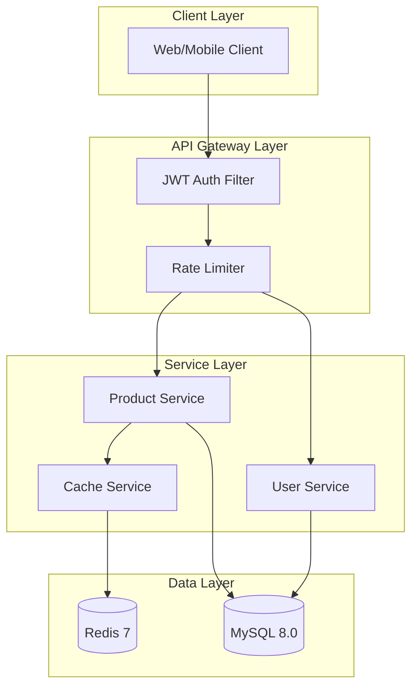
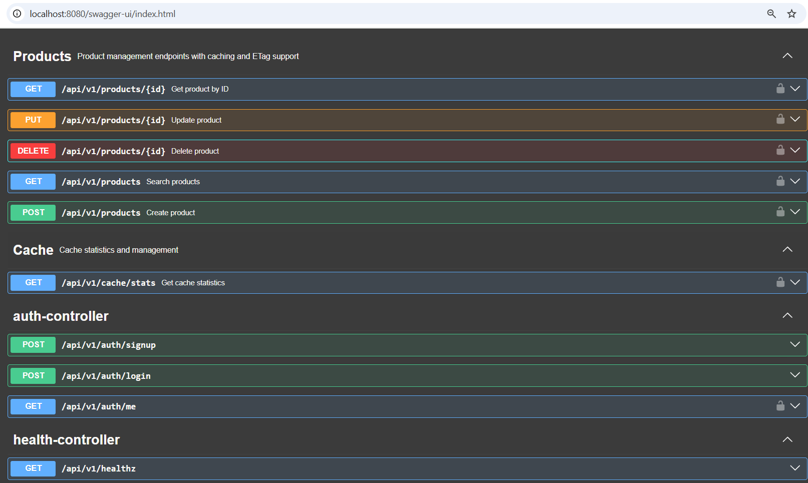
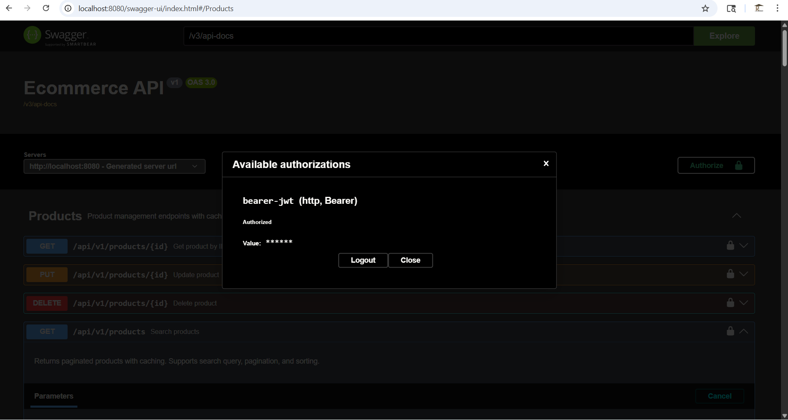
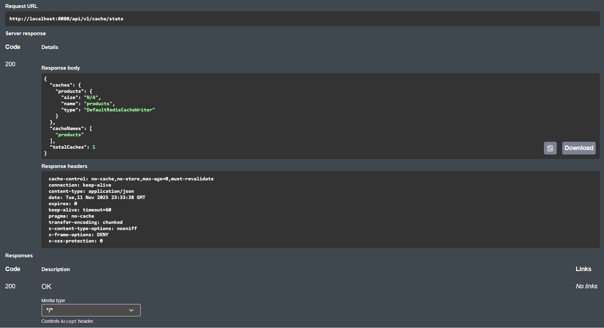

# E-Commerce Backend API

[](https://openjdk.org)
[](https://spring.io/projects/spring-boot)
[](https://docker.com)
[](https://redis.io)
[](LICENSE)
[](https://github.com/rishabh23rohil/ecommerce-springboot/actions)

> Production-ready REST API featuring JWT authentication, role-based access control, Redis caching with ETag support, and comprehensive test coverage.

---

## Architecture



---

## Skills Demonstrated

| Skill | Implementation |
|-------|----------------|
| **API Design** | RESTful endpoints with OpenAPI/Swagger documentation |
| **Authentication** | JWT-based stateless auth with BCrypt password hashing |
| **Authorization** | Role-based access control (RBAC) with Spring Security |
| **Caching** | Redis with @Cacheable, ETag/304 support, cache invalidation |
| **Database** | JPA with Flyway migrations, optimized queries |
| **Containerization** | Multi-stage Docker build, Docker Compose orchestration |
| **Testing** | Unit + integration tests, 80%+ coverage with JaCoCo |
| **CI/CD** | GitHub Actions pipeline with automated testing |
| **Resilience** | Circuit breakers, rate limiting, retry mechanisms |

---

## Tech Stack

| Layer | Technology |
|-------|------------|
| Framework | Spring Boot 3.3, Spring Security |
| Database | MySQL 8.0, Spring Data JPA |
| Caching | Redis 7, Spring Data Redis |
| Migrations | Flyway |
| Auth | JWT (jjwt), BCrypt |
| Docs | SpringDoc OpenAPI 3 (Swagger) |
| Build | Maven, Docker |
| CI/CD | GitHub Actions |

---

## Screenshots

| Swagger UI | JWT Auth | Cache Stats |
|------------|----------|-------------|
|  |  |  |

---

## Quick Start

### Docker (Recommended)

```bash
# Clone and start
git clone https://github.com/rishabh23rohil/ecommerce-springboot.git
cd ecommerce-springboot
docker compose up -d

# Verify
curl http://localhost:8080/api/v1/healthz
```

### Local Development

```bash
# Start databases
docker compose up -d mysql redis

# Run application
mvn spring-boot:run -Dspring-boot.run.profiles=local
```

**Access Points:**
- API: http://localhost:8080
- Swagger UI: http://localhost:8080/swagger-ui.html

---

## API Endpoints

### Public

| Method | Endpoint | Description |
|--------|----------|-------------|
| GET | `/api/v1/healthz` | Health check |
| POST | `/api/v1/auth/signup` | Register user |
| POST | `/api/v1/auth/login` | Get JWT token |

### Authenticated

| Method | Endpoint | Role | Description |
|--------|----------|------|-------------|
| GET | `/api/v1/auth/me` | USER | Current user info |
| GET | `/api/v1/products` | USER | List products (cached) |
| GET | `/api/v1/products/{id}` | USER | Get product (ETag support) |
| POST | `/api/v1/products` | ADMIN | Create product |
| PUT | `/api/v1/products/{id}` | ADMIN | Update product |
| DELETE | `/api/v1/products/{id}` | ADMIN | Delete product |
| GET | `/api/v1/cache/stats` | ADMIN | Cache statistics |

---

## Authentication Flow

```bash
# 1. Register
curl -X POST http://localhost:8080/api/v1/auth/signup \
  -H "Content-Type: application/json" \
  -d '{"email":"user@example.com","password":"SecurePass123!"}'

# 2. Use token
curl -H "Authorization: Bearer <token>" \
  http://localhost:8080/api/v1/products
```

---

## Caching Strategy

| Feature | Implementation |
|---------|----------------|
| TTL | 10 minutes |
| Invalidation | On any write (POST/PUT/DELETE) |
| ETag | 304 Not Modified for unchanged resources |
| Monitoring | `/api/v1/cache/stats` endpoint |

---

## Project Structure

```
src/main/java/com/rishabh/
├── api/                    # Health endpoints
└── ecom/
    ├── auth/               # JWT authentication
    │   ├── AuthController  # Login/signup endpoints
    │   ├── JwtService      # Token generation/validation
    │   └── JwtAuthFilter   # Request filter
    ├── product/            # Product CRUD
    │   ├── ProductController
    │   ├── ProductService  # Business logic + caching
    │   └── ProductRepository
    ├── user/               # User/Role entities
    ├── config/             # Security, Redis, OpenAPI
    └── common/             # Exception handling
```

---

## Testing

```bash
# Run all tests
mvn test

# With coverage report
mvn test jacoco:report
```

---

## Configuration

| Variable | Description | Default |
|----------|-------------|---------|
| `APP_JWT_SECRET` | JWT signing key | Dev secret |
| `APP_JWT_EXPIRATION` | Token TTL (seconds) | 3600 |
| `SPRING_PROFILES_ACTIVE` | Profile | local |

---

## Roadmap

- [x] JWT Authentication & RBAC
- [x] Product CRUD with caching
- [x] Docker + CI/CD
- [x] ETag support
- [ ] Message queues (RabbitMQ)
- [ ] Grafana dashboards

---

## Author

**Rishabh Rohil**

[](https://linkedin.com/in/rishabh-rohil)
[](https://github.com/rishabh23rohil)

---

## License

This project is licensed under the MIT License - see the [LICENSE](LICENSE) file for details.
