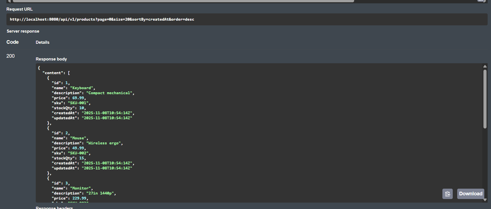
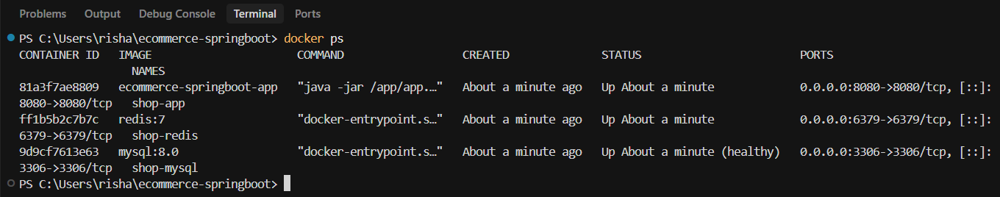

# E-Commerce Spring Boot Backend

REST API built with Spring Boot 3.3, featuring JWT authentication, role-based access control, product management, and Redis caching.

## Table of Contents

- [Overview](#overview)
- [Tech Stack](#tech-stack)
- [Features](#features)
- [Project Structure](#project-structure)
- [Prerequisites](#prerequisites)
- [Quick Start](#quick-start)
- [Configuration](#configuration)
- [API Documentation](#api-documentation)
- [Authentication & Authorization](#authentication--authorization)
- [Database Schema](#database-schema)
- [Development](#development)
- [Testing](#testing)
- [Docker Deployment](#docker-deployment)
- [Milestones Completed](#milestones-completed)

## Overview

RESTful e-commerce backend API that provides:
- Product Management: CRUD operations with search, filtering, and pagination
- JWT Authentication: Stateless token-based authentication
- Role-Based Access Control: Admin and User roles with permissions
- Redis Caching: Caching layer for product data
- Database Migrations: Version-controlled schema with Flyway
- API Documentation: Swagger UI

## Tech Stack

### Core Framework
- Java 17
- Spring Boot 3.3.4
- Spring Security - Authentication & Authorization
- Spring Data JPA - Database access
- Spring Data Redis - Caching

### Database & Caching
- MySQL 8.0 - Primary database
- Redis 7 - Caching layer
- Flyway - Database migrations

### Security
- JWT (jjwt 0.11.5) - Token-based authentication
- BCrypt - Password hashing

### Documentation & Tools
- SpringDoc OpenAPI 3 - API documentation (Swagger UI)
- Maven - Build tool
- Docker & Docker Compose - Containerization

## Features

### Milestone 0-1: Foundation
- RESTful API structure
- Health check endpoints
- Global exception handling
- Swagger UI integration

### Milestone 2: Product Management
- Product CRUD operations
- Search and filtering
- Pagination and sorting
- Redis caching integration
- Database migrations with Flyway

### Milestone 3: Docker & Profiles
- Docker containerization
- Docker Compose setup
- Environment profiles (local, docker)
- Health checks and service dependencies

### Milestone 4: Authentication & Authorization
- JWT-based authentication
- User registration and login
- Role-based access control (RBAC)
- Password hashing (BCrypt)
- Protected endpoints
- Swagger JWT integration

### Milestone 5: Caching & Performance
- Redis-based caching for product reads
- ETag / If-None-Match conditional requests (304 Not Modified)
- Cache invalidation on writes (POST, PUT, DELETE)
- Cache hit/miss logging
- Cache statistics endpoint
- Redis cache configuration
- Null-safe cache key generation
- JWT filter optimization for public endpoints
- N+1 query prevention ready

### Milestone 6: Testing & Production Readiness
- Unit tests (80%+ coverage)
- Integration tests with Testcontainers
- E2E tests with full application context
- CI/CD pipeline (GitHub Actions)
- Code coverage reporting (JaCoCo)
- Observability (Metrics, Tracing)
- Circuit breakers & Retry mechanisms
- Rate limiting configuration
- Security headers
- API versioning support

## Project Structure

```
ecommerce-springboot/
├── src/
│   ├── main/
│   │   ├── java/
│   │   │   └── com/rishabh/
│   │   │       ├── api/
│   │   │       │   └── HealthController.java      # Health check endpoints
│   │   │       └── ecom/
│   │   │           ├── EcommerceApplication.java  # Main application class
│   │   │           ├── auth/                      # Authentication module
│   │   │           │   ├── AuthController.java    # Auth REST endpoints
│   │   │           │   ├── AuthService.java        # Auth business logic
│   │   │           │   ├── AuthDtos.java          # Auth DTOs
│   │   │           │   ├── JwtService.java        # JWT token operations
│   │   │           │   └── JwtAuthFilter.java     # JWT filter
│   │   │           ├── user/                       # User module
│   │   │           │   ├── User.java              # User entity
│   │   │           │   ├── Role.java              # Role entity
│   │   │           │   ├── UserRepository.java
│   │   │           │   └── RoleRepository.java
│   │   │           ├── product/                     # Product module
│   │   │           │   ├── Product.java            # Product entity
│   │   │           │   ├── ProductController.java  # Product REST endpoints
│   │   │           │   ├── ProductService.java     # Product business logic
│   │   │           │   ├── ProductRepository.java
│   │   │           │   ├── ProductSpecifications.java
│   │   │           │   └── dto/
│   │   │           │       └── ProductDtos.java
│   │   │           ├── config/                      # Configuration
│   │   │           │   ├── SecurityConfig.java     # Spring Security config
│   │   │           │   ├── OpenApiConfig.java      # Swagger config
│   │   │           │   └── RedisCacheConfig.java   # Redis config
│   │   │           └── common/
│   │   │               └── GlobalExceptionHandler.java
│   │   └── resources/
│   │       ├── application.yml                     # Base config
│   │       ├── application-local.yml                # Local profile
│   │       ├── application-docker.yml               # Docker profile
│   │       └── db/
│   │           └── migration/
│   │               ├── V1__init.sql                # Products table
│   │               └── V2__users_roles_jwt.sql     # Users & roles tables
│   └── test/
├── docker-compose.yml                               # Docker services
├── Dockerfile                                       # App container
├── pom.xml                                          # Maven dependencies
└── README.md                                        # This file
```

## Prerequisites

- Java 17+ (JDK)
- Maven 3.6+
- Docker & Docker Compose (for containerized setup)
- MySQL 8.0 (if running locally without Docker)
- Redis 7 (if running locally without Docker)

## Quick Start

### Option 1: Docker Compose

1. Clone the repository (if applicable)
   ```bash
   git clone <repository-url>
   cd ecommerce-springboot
   ```

2. Start all services
   ```bash
   docker compose up -d
   ```

3. Verify services are running
   ```bash
   docker ps
   ```

4. Check application logs
   ```bash
   docker logs -f shop-app
   ```

5. Access the application
   - API: http://localhost:8080
   - Swagger UI: http://localhost:8080/swagger-ui.html
   - Health Check: http://localhost:8080/api/v1/healthz

### Option 2: Local Development

1. Start MySQL and Redis (or use Docker for these only)
   ```bash
   # Using Docker for databases only
   docker compose up -d mysql redis
   ```

2. Build the project
   ```bash
   mvn clean package
   ```

3. Run the application
   ```bash
   mvn spring-boot:run -Dspring-boot.run.profiles=local
   ```

   Or run with your IDE using profile: `local`

## Configuration

### Application Profiles

#### `application.yml` (Base)
- Server port: 8080
- JPA configuration
- Flyway migrations enabled
- Redis cache type

#### `application-local.yml` (Local Development)
```yaml
spring:
  datasource:
    url: jdbc:mysql://localhost:3306/shop
    username: app
    password: app
  data:
    redis:
      host: localhost
      port: 6379

app:
  jwt:
    secret: "CHANGE_ME_TO_A_RANDOM_64+_CHAR_SECRET"
    expirationSeconds: 3600
    issuer: "ecom-api"
```

#### `application-docker.yml` (Docker)
- Uses service names: `mysql` and `redis`
- Same JWT configuration

### Environment Variables

For production, override JWT secret:
```bash
export APP_JWT_SECRET="your-64-char-secret-here"
```

Or in `application.yml`:
```yaml
app:
  jwt:
    secret: ${APP_JWT_SECRET:default-secret}
```

## API Documentation

### Swagger UI

API documentation is available at:
- URL: http://localhost:8080/swagger-ui/index.html
- Alternative: http://localhost:8080/swagger-ui.html (redirects to index.html)

Note: Swagger UI is publicly accessible and does not require authentication. However, to test authenticated endpoints, you must authorize with a JWT token.

### Using Swagger with JWT

1. Open Swagger UI
2. Click the "Authorize" button (lock icon)
3. In the `bearer-jwt` field, paste your JWT token (without "Bearer " prefix)
4. Click "Authorize", then "Close"
5. All authenticated endpoints will now include the Authorization header

### API Endpoints

#### Health Check
```
GET /api/v1/healthz
GET /actuator/health
```

#### Authentication (Public)
```
POST /api/v1/auth/signup
POST /api/v1/auth/login
GET  /api/v1/auth/me          # Requires authentication
```

#### Products
```
GET    /api/v1/products           # Requires authentication (cached)
GET    /api/v1/products/{id}       # Requires authentication (cached, ETag support)
POST   /api/v1/products           # Requires ADMIN role (invalidates cache)
PUT    /api/v1/products/{id}      # Requires ADMIN role (invalidates cache)
DELETE /api/v1/products/{id}      # Requires ADMIN role (invalidates cache)
```

#### Cache Management
```
GET    /api/v1/cache/stats        # Requires ADMIN role (cache statistics)
```

## Screenshots

### Swagger UI

*API documentation showing all available endpoints*


*JWT token authorization dialog in Swagger UI*


*API response example in Swagger UI*

### Infrastructure

*Docker containers running: MySQL, Redis, and Spring Boot application*


*Application startup logs showing successful initialization*

### API Endpoints

*Cache statistics endpoint (admin only)*

## Authentication & Authorization

### User Registration

**Endpoint**: `POST /api/v1/auth/signup`

**Request Body**:
```json
{
  "email": "user@example.com",
  "password": "SecurePass123!"
}
```

**Response** (201 Created):
```json
{
  "token": "eyJhbGciOiJIUzUxMiJ9...",
  "tokenType": "Bearer",
  "expiresInSeconds": 3600
}
```

**Validation**:
- Email must be valid format
- Password must be 8-72 characters

### User Login

**Endpoint**: `POST /api/v1/auth/login`

**Request Body**:
```json
{
  "email": "user@example.com",
  "password": "SecurePass123!"
}
```

**Response** (200 OK):
```json
{
  "token": "eyJhbGciOiJIUzUxMiJ9...",
  "tokenType": "Bearer",
  "expiresInSeconds": 3600
}
```

### Get Current User

**Endpoint**: `GET /api/v1/auth/me`

**Headers**:
```
Authorization: Bearer <token>
```

**Response** (200 OK):
```json
{
  "email": "user@example.com",
  "roles": ["ROLE_USER", "ROLE_ADMIN"]
}
```

### Using JWT Token

Include the token in the Authorization header:
```bash
curl -H "Authorization: Bearer <your-token>" \
  http://localhost:8080/api/v1/products
```

### Roles

- **ROLE_USER**: Can read products
- **ROLE_ADMIN**: Can read, create, update, and delete products

### Security Rules

| Endpoint | Method | Access |
|----------|--------|--------|
| `/api/v1/healthz` | GET | Public |
| `/actuator/health` | GET | Public |
| `/swagger-ui/**` | GET | Public |
| `/swagger-resources/**` | GET | Public |
| `/webjars/**` | GET | Public |
| `/v3/api-docs/**` | GET | Public |
| `/api/v1/auth/signup` | POST | Public |
| `/api/v1/auth/login` | POST | Public |
| `/api/v1/auth/me` | GET | Authenticated |
| `/api/v1/products` | GET | Authenticated |
| `/api/v1/products` | POST | ADMIN only |
| `/api/v1/products/{id}` | PUT | ADMIN only |
| `/api/v1/products/{id}` | DELETE | ADMIN only |
| `/api/v1/cache/stats` | GET | ADMIN only |

## Database Schema

### Products Table
```sql
CREATE TABLE products (
  id BIGINT PRIMARY KEY AUTO_INCREMENT,
  sku VARCHAR(64) NOT NULL UNIQUE,
  name VARCHAR(255) NOT NULL,
  description TEXT,
  price DECIMAL(10,2) NOT NULL,
  stock_qty INT NOT NULL DEFAULT 0,
  created_at TIMESTAMP NOT NULL DEFAULT CURRENT_TIMESTAMP,
  updated_at TIMESTAMP NOT NULL DEFAULT CURRENT_TIMESTAMP ON UPDATE CURRENT_TIMESTAMP
);
```

### Users Table
```sql
CREATE TABLE users (
  id BIGINT PRIMARY KEY AUTO_INCREMENT,
  email VARCHAR(255) NOT NULL UNIQUE,
  password VARCHAR(100) NOT NULL,
  enabled BOOLEAN NOT NULL DEFAULT TRUE,
  created_at TIMESTAMP NOT NULL DEFAULT CURRENT_TIMESTAMP,
  updated_at TIMESTAMP NOT NULL DEFAULT CURRENT_TIMESTAMP ON UPDATE CURRENT_TIMESTAMP
);
```

### Roles Table
```sql
CREATE TABLE roles (
  id BIGINT PRIMARY KEY AUTO_INCREMENT,
  name VARCHAR(64) NOT NULL UNIQUE
);
```

### User Roles (Join Table)
```sql
CREATE TABLE user_roles (
  user_id BIGINT NOT NULL,
  role_id BIGINT NOT NULL,
  PRIMARY KEY (user_id, role_id),
  FOREIGN KEY (user_id) REFERENCES users(id) ON DELETE CASCADE,
  FOREIGN KEY (role_id) REFERENCES roles(id) ON DELETE CASCADE
);
```

### Default Roles
- `ROLE_USER` - Standard user role
- `ROLE_ADMIN` - Administrator role

## Development

### Creating an Admin User

1. Sign up a new user
   ```bash
   curl -X POST http://localhost:8080/api/v1/auth/signup \
     -H "Content-Type: application/json" \
     -d '{"email":"admin@shop.test","password":"Admin123!"}'
   ```

2. Promote to admin (via MySQL)
   ```bash
   docker exec -i shop-mysql mysql -uroot -proot shop -e "
   INSERT INTO user_roles (user_id, role_id)
   SELECT u.id, r.id FROM users u, roles r
   WHERE u.email='admin@shop.test' AND r.name='ROLE_ADMIN'
   ON DUPLICATE KEY UPDATE user_id=user_id;"
   ```

3. Login to get token
   ```bash
   curl -X POST http://localhost:8080/api/v1/auth/login \
     -H "Content-Type: application/json" \
     -d '{"email":"admin@shop.test","password":"Admin123!"}'
   ```

### Building the Project

```bash
# Clean and compile
mvn clean compile

# Run tests
mvn test

# Package JAR
mvn clean package

# Skip tests
mvn clean package -DskipTests
```

### Database Migrations

Flyway automatically runs migrations on startup. Migrations are located in:
```
src/main/resources/db/migration/
```

Naming convention: `V{version}__{description}.sql`

Current migrations:
- `V1__init.sql` - Products table
- `V2__users_roles_jwt.sql` - Users, roles, and user_roles tables

## Testing

### Manual API Testing

#### 1. Health Check
```bash
curl http://localhost:8080/api/v1/healthz
```

#### 2. Signup
```bash
curl -X POST http://localhost:8080/api/v1/auth/signup \
  -H "Content-Type: application/json" \
  -d '{"email":"test@example.com","password":"Test123!"}'
```

#### 3. Login
```bash
curl -X POST http://localhost:8080/api/v1/auth/login \
  -H "Content-Type: application/json" \
  -d '{"email":"test@example.com","password":"Test123!"}'
```

#### 4. Get Products (Authenticated)
```bash
# Replace <token> with actual JWT token
curl -H "Authorization: Bearer <token>" \
  "http://localhost:8080/api/v1/products?page=0&size=10"
```

#### 5. Get Current User
```bash
curl -H "Authorization: Bearer <token>" \
  http://localhost:8080/api/v1/auth/me
```

### PowerShell Testing

```powershell
# Signup
curl.exe -X POST http://localhost:8080/api/v1/auth/signup `
  -H "Content-Type: application/json" `
  -d '{\"email\":\"admin@shop.test\",\"password\":\"Admin123!\"}'

# Login and extract token
$resp = curl.exe -s -X POST http://localhost:8080/api/v1/auth/login `
  -H "Content-Type: application/json" `
  -d '{\"email\":\"admin@shop.test\",\"password\":\"Admin123!\"}'
$json = $resp | ConvertFrom-Json
$jwt = $json.token

# Test authenticated endpoint
curl.exe "http://localhost:8080/api/v1/products?page=0&size=5" `
  -H "Authorization: Bearer $jwt"
```

### Verify Security

1. Test unauthenticated access (should return 403)
   ```bash
   curl http://localhost:8080/api/v1/products
   ```

2. Test with invalid token (should return 401)
   ```bash
   curl -H "Authorization: Bearer invalid-token" \
     http://localhost:8080/api/v1/products
   ```

## Docker Deployment

### Docker Compose Services

- **mysql**: MySQL 8.0 database
- **redis**: Redis 7 cache
- **app**: Spring Boot application

### Docker Commands

```bash
# Start all services
docker compose up -d

# Stop all services
docker compose down

# View logs
docker logs -f shop-app

# Rebuild and restart
docker compose up -d --build

# Stop specific service
docker compose stop app

# Restart specific service
docker compose restart app
```

### Dockerfile

The application uses a multi-stage build:
- Build stage: Compiles the application
- Runtime stage: Runs the JAR file

### Volumes

- `mysql_data`: Persistent MySQL data storage

## Milestones Completed

### Milestone 0: Project Setup
- Spring Boot 3.3.4 project structure
- Maven configuration
- Basic REST controller
- Health check endpoint

### Milestone 1: API Foundation
- Global exception handling
- Swagger/OpenAPI integration
- RESTful API conventions
- Response standardization

### Milestone 2: Product Management
- Product entity and repository
- Product CRUD operations
- Search and filtering
- Pagination and sorting
- Redis caching integration
- Flyway database migrations

### Milestone 3: Docker & Profiles
- Docker containerization
- Docker Compose orchestration
- Environment profiles (local, docker)
- Service health checks
- Volume persistence

### Milestone 4: Authentication & Authorization
- JWT-based authentication
- User and Role entities
- BCrypt password hashing
- Role-based access control (RBAC)
- Protected endpoints
- Swagger JWT integration
- User registration and login

### Milestone 5: Caching & Performance
- Redis-based caching with `@Cacheable` annotations
- Product search and get-by-ID caching
- Automatic cache invalidation on writes
- ETag support for conditional GET requests (304 Not Modified)
- Cache statistics endpoint (`/api/v1/cache/stats`)
- Cache hit/miss logging for monitoring
- Redis serialization (Jackson JSON)
- 10-minute TTL for cached entries
- Transaction-aware cache manager
- Null-safe cache key generation
- JWT filter optimization for public endpoints (Swagger UI, health checks)

### Milestone 6: Testing & Production Readiness
- Unit tests (80%+ coverage target)
- Integration tests with Testcontainers
- E2E tests with full application context
- CI/CD pipeline (GitHub Actions)
- Code coverage reporting (JaCoCo)
- Observability (Metrics, Tracing)
- Circuit breakers & Retry mechanisms
- Rate limiting configuration
- Security headers
- API versioning support

## Future Milestones

- **Milestone 7**: Advanced Features (Message Queues, Event-Driven Architecture)
- **Milestone 8**: Scalability (Load Balancing, Horizontal Scaling)
- **Milestone 9**: Advanced Monitoring (Grafana Dashboards, Alerting)

## Notes

### JWT Secret

**Important**: Change the JWT secret in production. The default secret in `application.yml` is for development only.

For production:
1. Generate a secure random 64+ character string
2. Store it in environment variables or a secret manager
3. Never commit secrets to version control

### Password Requirements

- Minimum length: 8 characters
- Maximum length: 72 characters
- Passwords are hashed using BCrypt

### Token Expiration

Default JWT token expiration: 3600 seconds (1 hour)

Configure in `application.yml`:
```yaml
app:
  jwt:
    expirationSeconds: 3600  # Adjust as needed
```

### Caching Strategy

#### Cache Configuration
- TTL: 10 minutes for all cached entries
- Cache Names: 
  - `products` - Product search results (keyed by query params)
  - `productById` - Individual products (keyed by ID)
- Invalidation: All caches invalidated on any write operation (POST, PUT, DELETE)

#### ETag Support
Products support conditional GET requests using ETags:
- First request returns `ETag` header with product's `updatedAt` timestamp
- Subsequent requests with `If-None-Match` header return `304 Not Modified` if unchanged
- Reduces bandwidth and improves performance

#### Cache Performance
- Target: 90%+ cache hit rate for read operations
- Monitoring: Cache statistics available via `/api/v1/cache/stats` (admin only)
- Logging: Cache hits/misses logged at DEBUG level

#### Example: Using ETag
```bash
# First request - get product and ETag
curl -i -H "Authorization: Bearer <token>" \
  http://localhost:8080/api/v1/products/1

# Response includes: ETag: "1731340800000"

# Conditional request - returns 304 if unchanged
curl -i -H "Authorization: Bearer <token>" \
  -H "If-None-Match: \"1731340800000\"" \
  http://localhost:8080/api/v1/products/1
```

## Contributing

1. Fork the repository
2. Create a feature branch
3. Make your changes
4. Test thoroughly
5. Submit a pull request

## License

[Add your license here]

## Author

**Rishabh**

## Acknowledgments

- Spring Boot team
- Spring Security team
- JJWT library maintainers
- OpenAPI/Swagger community

---

**Last Updated**: November 2025  
**Version**: 0.1.0-SNAPSHOT  
**Status**: Active Development
